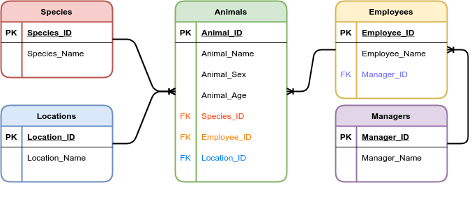

### Agora, a prática:

1. Caso não tenha feito ainda, refaça o banco de dados `albuns` por conta própria, como está descrito na seção " **Hora de mexer os dedos** ".

   ```sql
   CREATE DATABASE IF NOT EXISTS albuns;
   
   USE albuns;
   
   CREATE TABLE artista(
   	artista_id INT PRIMARY KEY AUTO_INCREMENT,
       nome VARCHAR(50)
   ) ENGINE =InnoDB;
   
   CREATE TABLE estilomusical(
   	estilo_id INT PRIMARY KEY AUTO_INCREMENT,
       nome VARCHAR(50) NOT NULL
   ) ENGINE=InnoDB;
   
   CREATE TABLE album(
   	album_id INT PRIMARY KEY AUTO_INCREMENT,
       artist_id INT NOT NULL,
       titulo VARCHAR(100) NOT NULL,
       preco DECIMAL(5,2) NOT NULL,
       estilo_id INT NOT NULL,
       FOREIGN KEY (artist_id) REFERENCES artista(artista_id),
       FOREIGN KEY (estilo_id)REFERENCES estilomusical(estilo_id)
   ) ENGINE=InnoDB;
   ```

   

2. Faça [este quiz ](https://www.sanfoundry.com/sql-mcqs-mysql-datatypes-1/)sobre tipos de dados no MySQL.

3. Faça [este quiz ](https://www.sanfoundry.com/sql-mcqs-mysql-datatypes-2/)sobre como escolher tipos de dados no MySQL.

4. Um zoológico precisa de um banco de dados para armazenar informações sobre os seus animais. As informações a serem armazenadas sobre cada animal são:

   - Nome;

   - Espécie;

   - Sexo;

   - Idade;

   - Localização.

     

     Cada animal também possui **um** cuidador, e cada cuidador pode ser responsável por mais de um animal. Além disso, cada cuidador possui **um** gerente, sendo que cada gerente pode ser responsável por mais de um cuidador. Siga os passos aprendidos no dia de hoje para modelar essa base de dados.

     

